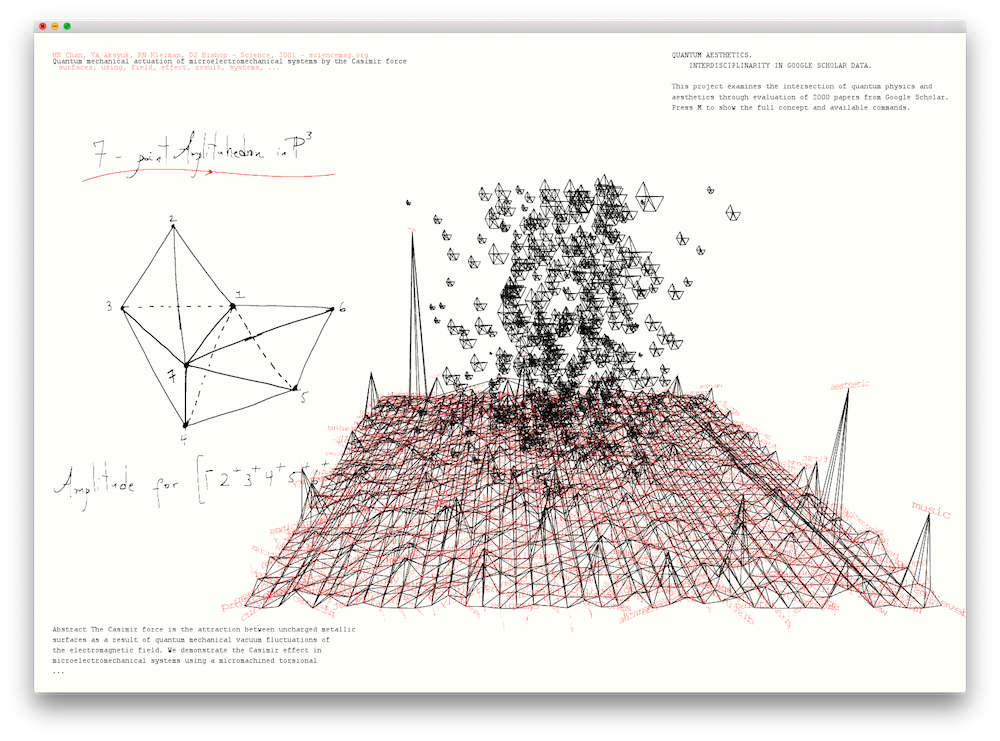
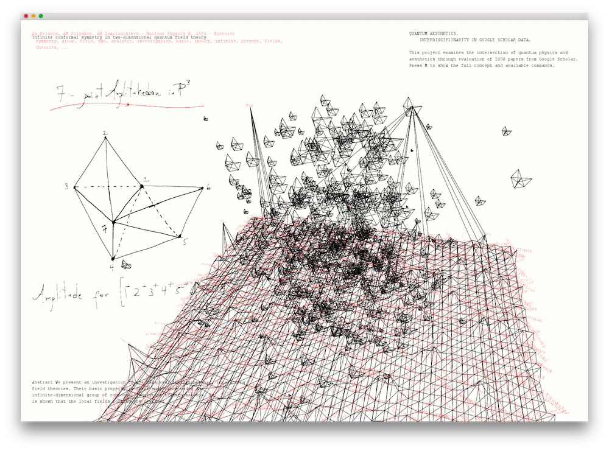
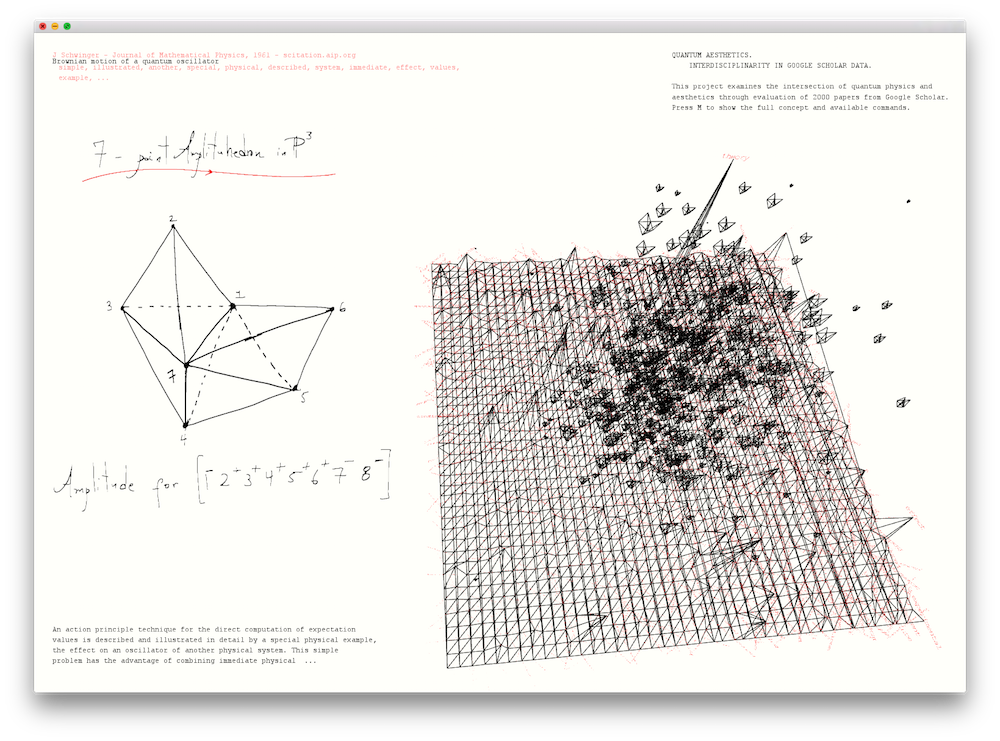

This is an [openFrameworks 0.90+](http://openframeworks.cc/) project. Please integrate the `src` and `bin/data` folders into a new project. No dependencies.

# Quantum Aesthetics

This project examines the literal "common ground" of quantum physics and aesthetics through evaluation of 2000 papers from [Google Scholar](http://scholar.google.com). The most common keywords from the "quantum" papers set the terrain on which the "aesthetics" papers are mapped as a cloud of amplitudhedrons, a [recently discovered jewel-like geometric object](http://arxiv.org/pdf/1312.2007v1.pdf) that dramatically simplifies calculations of particle interactions. The size of each amplitudhedron is correlated to the number of matching keywords on the terrain, while its height is correlated to the corresponding paper's rank in the Google scholar search.

Google Scholar, for obvious reasons (ads, licensing etc.), does not want to give individuals an easy API access to its data, not to speak of automated data crawlers ("bots"). This is why I built a custom Google Scholar scraper in Python that works in three steps:

- It sends an HTTP request for just one page of search results to the Google server via a randomly selected proxy server and with a randomly selected user agent in the request header.
- It parses the received HTML data, using the [Beautiful Soup library](http://www.crummy.com/software/BeautifulSoup), for tags that were identified before by hand to enclose the data that we are looking for.
- It identifies the most common keywords for a single paper with the help of natural language processing methods, neatly stacks the data and writes it to a CSV file.
- It waits for a random amount of time, increases the results page number and then goes back to the first step until the maximum of 1000 results (a number hardcoded by Google into Google Scholar) is reached.
- It writes the accumulated, most common keywords to a different CSV file.

I worked in A4 (landscape), creating an "analog" interface that takes up graphical elements and color schemes from hand-written plans and diagrams (delicate lines, black and red ink on slightly toned down white paper) while still being three-dimensional, interactive, and animated. I deliberately included the possibility for text, set in a serifed typewriter font, to overlap, fade, and disappear.

Interestingly, the visualization actually allows to get to the quintessential "overlap" of quantum physics and aesthetics, which is the world of abstract reasoning. Shared high-scoring keywords like "theory", "investigation", "assume", "system", "analytic", and others are the literal "common ground" of both disciplines, their analytical framework for exploring their respective subjects. But the visualization also provides even more useful results in the form of single papers that deal with exactly this overlap, one example being "Philosophy of Quantum Mechanics" (M. Jammer, 1974), represented by one of the largest and highest-scoring amplituhedrons in the visualization. Finally, there are several other possible uses for the visualization's analytical back-end, namely looking at shared interests of different authors, or finding the "missing link" between two specific questions.

I further explored this topic conceptually in my 2015 SIGGRAPH Asia paper: Fabian Offert, [Conceptual Superposition. The Aesthetics of Quantum Simulation](http://dl.acm.org/citation.cfm?id=2835643), in: SIGGRAPH Asia 2015 Art Papers.
